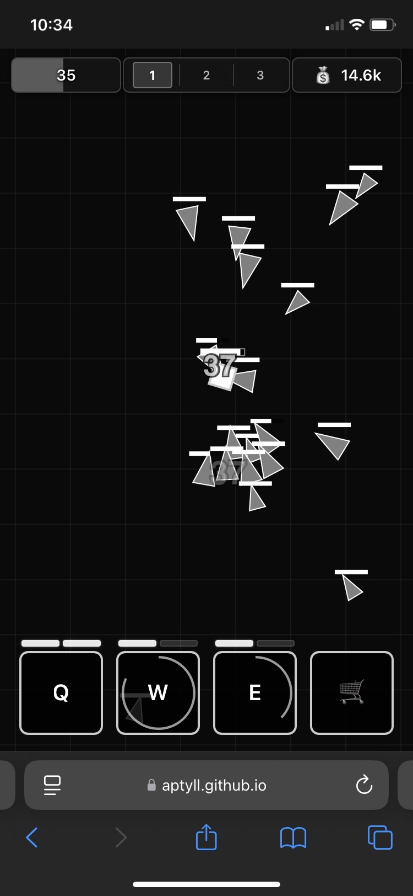

# Nonstop Knight

  

## Cross-Platform Mobile Game Experience

I'm using GitHub Pages to simulate a mobile game experience. By hosting the game on a web link, I can play it on my phone through the browser—essentially making it a mobile app. The best part? I write code on my desktop, test it on my desktop, and it's instantly cross-platform. No app stores, no separate builds—just code once and play anywhere.

